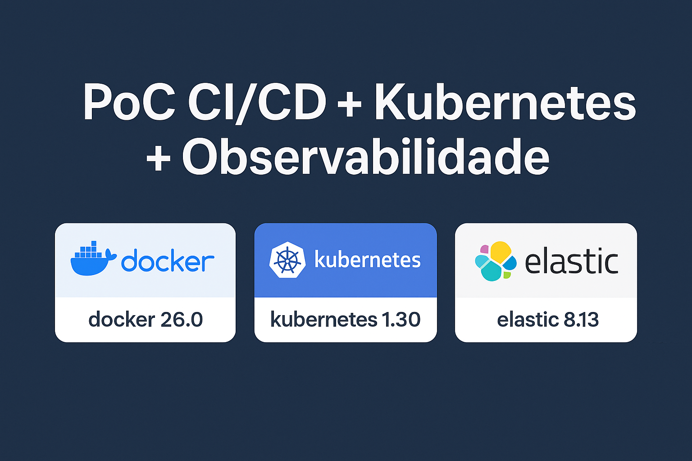
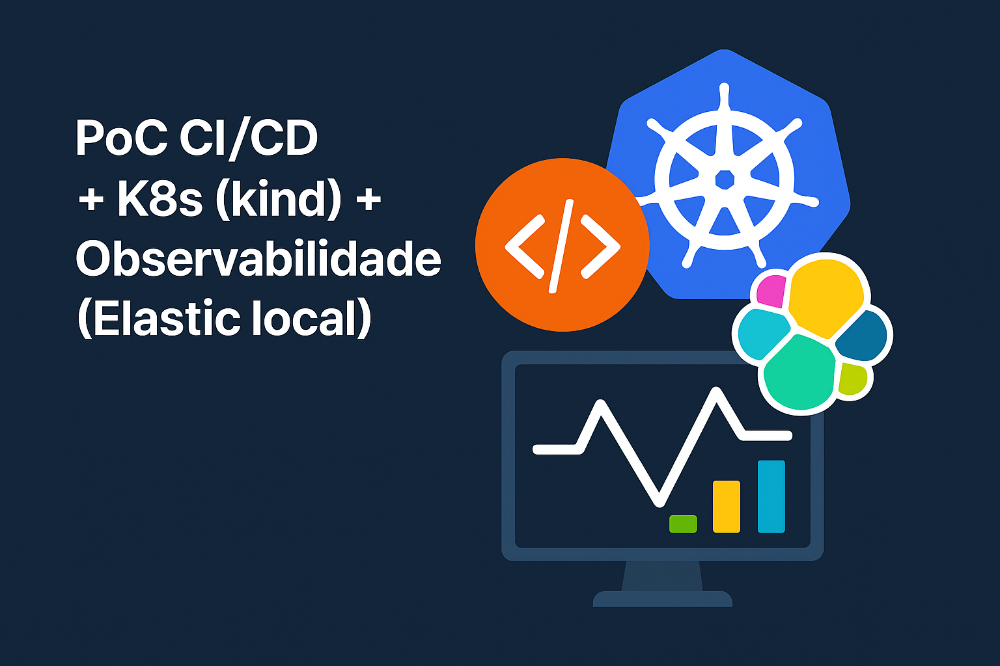

# PoC CI/CD + K8s (kind) + Observabilidade (Elastic local)

<p align="center">
  
</p>

<p align="center">
  
</p>

---

## 0) Visão geral

Esta PoC comprova **DevOps + SRE + Observabilidade** localmente **sem usar registry**.  
A imagem Docker é construída no host, **carregada no cluster kind** e o deploy acontece com `kubectl`.  
A observabilidade é feita por **OpenTelemetry Collector → APM Server → Elasticsearch → Kibana (APM)**.

```
Dev → Git push → Jenkins (Docker)
      ├─ docker build sampleapp:<TAG>
      ├─ kind load docker-image sampleapp:<TAG>
      ├─ kubectl apply (Deploy/Service)
      └─ Job k6 (smoke + thresholds)

[SampleApp] -- OTLP --> [OTel Collector] -- OTLP --> [APM Server]
                                            ↘ logging (stdout)
         [APM Server] → [Elasticsearch] ↔ [Kibana (APM)]
```

**Por que funciona sem registry?**  
`kind load docker-image` copia a imagem local para o runtime dos nós do cluster kind.  
Com `imagePullPolicy: IfNotPresent`, o kubelet **encontra a imagem local** e não tenta fazer pull externo.

---

## 1) Estrutura do repositório

```
.
├─ Jenkinsfile                           # pipeline sem registry (build → kind load → deploy → k6)
├─ kind-cluster.yaml                     # cluster kind (1 control-plane, 1 worker)
├─ sampleapp/                            # app NodeJS demo
│  ├─ Dockerfile
│  ├─ package.json
│  └─ app.js                             # /login, /checkout, /error + healthz/readyz
└─ k8s/
   ├─ namespace.yaml                     # Namespace: cicd
   ├─ app/
   │  ├─ deployment.yaml                 # image: sampleapp:__TAG__ + envs OTel
   │  └─ service.yaml                    # ClusterIP (8080 → 3000)
   ├─ jobs/
   │  └─ k6-smoke-job.yaml               # k6 (vus=3, 20s, p95<300ms, erro<2%)
   └─ observability/
      ├─ elasticsearch.yaml              # ES single-node (sem auth) — PoC
      ├─ kibana.yaml                     # Kibana ↔ ES
      ├─ apm-server.yaml                 # APM Server (OTLP habilitado)
      └─ otel-collector.yaml             # OTel Collector (OTLP→APM + logging)
```

---

## 2) Pré‑requisitos

### Windows (recomendado nesta PoC)
- **Docker Desktop** (WSL2 habilitado).
- **kubectl.exe** no PATH → https://dl.k8s.io/release/v1.30.2/bin/windows/amd64/kubectl.exe  
- **kind.exe** no PATH → https://kind.sigs.k8s.io/dl/latest/kind-windows-amd64 (renomeie para `kind.exe`).

> Dica rápida (PATH): copie `kubectl.exe` e `kind.exe` para `C:\Windows\System32`  
> ou crie `C:\Ferramentas\k8s`, mova os `.exe` e adicione ao **Path**.

Validação:
```powershell
kind version
kubectl version --client
```

### macOS / Linux
- Docker, kubectl e kind instalados (brew/apt/yum).

---

## 3) Subindo o cluster kind

```powershell
kind create cluster --config kind-cluster.yaml
kubectl get nodes
```

**Ajuste necessário para o Elasticsearch (vm.max_map_count)**  
Os nós do kind são containers Linux; ajuste **dentro** de cada nó:
```powershell
docker exec -it poc-cicd-control-plane sysctl -w vm.max_map_count=262144
docker exec -it poc-cicd-worker         sysctl -w vm.max_map_count=262144
```
> Se recriar o cluster, reaplique o ajuste.

---

## 4) Jenkins local (Docker) com acesso ao Docker/K8s

Crie o volume de dados:
```powershell
mkdir jenkins_home
```

Suba o Jenkins:
```powershell
docker run -d --name jenkins `
  -p 8081:8080 -p 50000:50000 `
  -v "$PWD/jenkins_home:/var/jenkins_home" `
  -v "//var/run/docker.sock:/var/run/docker.sock" `
  -v "$env:USERPROFILE\.kube:/home/jenkins/.kube" `
  jenkins/jenkins:lts
```

Instale **kubectl** e **kind** **dentro** do container Jenkins (uma vez):
```bash
docker exec -it jenkins bash -lc '
  apt-get update && apt-get install -y curl ca-certificates;
  curl -Lo /usr/local/bin/kind https://kind.sigs.k8s.io/dl/v0.23.0/kind-linux-amd64 && chmod +x /usr/local/bin/kind;
  curl -Lo /usr/local/bin/kubectl https://dl.k8s.io/release/v1.30.2/bin/linux/amd64/kubectl && chmod +x /usr/local/bin/kubectl;
  kubectl version --client && kind version
'
```

Acesse **http://localhost:8081** e instale:
- **Pipeline**
- **Credentials Binding**
- **Timestamper**
- (Opcional) **Blue Ocean**

> O pipeline usa agente `any` — não precisa configurar agentes extras.

---

## 5) Pipeline (Jenkinsfile)

**Estágios e lógica:**
1. **Checkout**
2. **Unit tests** (Node 20 em container)
3. **Build da imagem local**
   ```bash
   docker build -t sampleapp:<TAG> -f sampleapp/Dockerfile .
   ```
4. **Load para o kind**
   ```bash
   kind load docker-image sampleapp:<TAG> --name poc-cicd
   ```
5. **Deploy**
   - Aplica `k8s/namespace.yaml`.
   - Sobe **Elasticsearch, Kibana, APM Server e OTel Collector**.
   - Troca `sampleapp:__TAG__` no `deployment.yaml` → aplica `k8s/app/`.
   - Aguarda `rollout` de `sampleapp`.
6. **Smoke (k6)**
   - Cria/roda Job `k6-smoke` (vus=3, 20s).
   - **Thresholds**: `http_req_failed: rate<0.02` e `http_req_duration: p(95)<300`.
   - Se violar thresholds ⇒ **falha** o pipeline.

---

## 6) Acessando o app e o Kibana

```powershell
# Kibana
kubectl -n cicd port-forward svc/kibana 5601:5601
# App
kubectl -n cicd port-forward svc/sampleapp 8080:8080
```

- **Kibana:** http://localhost:5601 → *Observability > APM*  
- **Aplicação:** http://localhost:8080/login

Gerar tráfego manual (opcional):
```powershell
Invoke-WebRequest http://localhost:8080/login     | Out-Null
Invoke-WebRequest http://localhost:8080/checkout  | Out-Null
Invoke-WebRequest http://localhost:8080/error     | Out-Null
```

---

## 7) Observabilidade: como tudo integra

- **OTel Collector**
  - Recebe **OTLP** (gRPC 4317 / HTTP 4318).
  - Exporta para:
    - **logging** (stdout do Pod – fácil de inspecionar),
    - **otlp/elastic** (gRPC) → **APM Server**.
- **APM Server**
  - OTLP habilitado (gRPC: 8200, HTTP: 8201).
  - Converte e indexa no **Elasticsearch**.
- **Kibana (APM)**
  - Visualiza serviços, transações, latência p95/p99, taxa de erro, traces e dependências.

> **PoC simplificada**: ES sem segurança/TLS. Em produção, habilite **TLS, usuários e roles**.

---

## 8) k6 como Quality Gate

Ver logs do job:
```bash
kubectl -n cicd logs job/k6-smoke
```

Reexecutar:
```bash
kubectl -n cicd delete job k6-smoke --ignore-not-found=true
kubectl -n cicd apply -f k8s/jobs/k6-smoke-job.yaml
kubectl -n cicd wait --for=condition=complete job/k6-smoke --timeout=180s
```

Ajustar thresholds: edite `options.thresholds` embutidos no manifest do job.

---

## 9) Troubleshooting

- **Elasticsearch em CrashLoopBackOff**  
  Quase sempre é `vm.max_map_count` baixo (reaplique nos nós do kind):
  ```powershell
  docker exec -it poc-cicd-control-plane sysctl -w vm.max_map_count=262144
  docker exec -it poc-cicd-worker         sysctl -w vm.max_map_count=262144
  kubectl -n cicd rollout restart deploy/elasticsearch
  ```

- **Jenkins sem acesso a Docker/K8s**  
  Confirme os mounts:
  - `//var/run/docker.sock:/var/run/docker.sock`
  - `$env:USERPROFILE\.kube:/home/jenkins/.kube`  
  Teste dentro do container: `kubectl get nodes` e `kind version`.

- **Sem dados no Kibana (APM vazio)**  
  Gere tráfego (k6/curl). Inspecione:
  ```bash
  kubectl -n cicd logs deploy/otel-collector -f
  kubectl -n cicd logs deploy/apm-server -f
  ```

- **k6 falhando thresholds**  
  Sua máquina pode estar no limite — aumente requests/limits do `sampleapp` ou relaxe thresholds.

- **Port‑forward não conecta**  
  Verifique Pods/Services:
  ```bash
  kubectl -n cicd get pods,svc -o wide
  ```

---

## 10) Extensões úteis

- **Logs/Métricas do cluster**: adicionar **Elastic Agent** (DaemonSet) + integrações Kubernetes/System/Prometheus.  
- **SLOs e Alertas (Kibana)**: defina SLI/SLO e crie alertas (Slack/Teams/Email).  
- **Quality Gate por SLO**: stage adicional no Jenkins que consulta a API do Kibana/Elastic e falha se orçamento de erro > limite.  
- **Segurança**: Trivy (scan), SBOM (Syft/Grype), OPA/Gatekeeper (políticas), assinaturas (cosign).  
- **Release strategies**: canary/blue‑green (Argo Rollouts) com rollback automático por métricas.

---

## 11) Limpeza

```powershell
docker rm -f jenkins
kind delete cluster --name poc-cicd
```

---

## 12) Glossário rápido

- **kind**: Kubernetes in Docker (cluster local).  
- **Jenkins**: servidor de automação CI/CD.  
- **OpenTelemetry**: padrão aberto para **traces, métricas e logs**.  
- **APM Server**: ingere OTLP/APM e indexa no Elasticsearch.  
- **Elasticsearch/Kibana**: armazenamento/visualização de observabilidade.  
- **k6**: testes de carga com **thresholds** (gates de qualidade).
